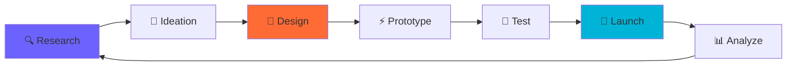

# 👋 Hello, I'm Jade Kevin Balocos

<div align="center">
  


</div>

<div align="center">
  
[](https://kevinbalocos.github.io/portfolio-v1/)
[](https://www.linkedin.com/in/jade-kevin-balocos-51b13b358/)
[](mailto:kevinbalocos@gmail.com)
[](#)
[](#)

</div>

---

## 🎯 About Me


```typescript
interface Developer {
  name: string;
  role: string[];
  location: string;
  experience: string;
  languages: string[];
  currentFocus: string[];
  lifePhilosophy: string;
}

const jade: Developer = {
  name: "Jade Kevin Balocos",
  role: ["UI/UX Designer", "Full-Stack Developer", "Creative Technologist"],
  location: "Santa Rosa, Philippines 🇵🇭",
  experience: "3+ years in digital product design",
  languages: ["JavaScript", "TypeScript", "Python", "PHP"],
  currentFocus: ["Design Systems", "Web3 UX", "AI-Driven Interfaces"],
  lifePhilosophy: "Code with purpose, design with empathy"
};
```

**🚀 Currently Working On:**
- Advanced Design System Architecture
- AI-Powered User Experience Optimization
- Next.js 14 Performance Engineering
- Data-Driven Design Methodology

---

## 🛠️ Tech Arsenal

<details>
<summary>🎨 <strong>Design & Creative Tools</strong></summary>
<br>


</details>

<details>
<summary>💻 <strong>Frontend Development</strong></summary>
<br>


</details>

<details>
<summary>🔧 <strong>Backend & Infrastructure</strong></summary>
<br>


</details>

<details>
<summary>📊 <strong>Data Science & Analytics</strong></summary>
<br>


</details>

---

## 🏆 Featured Projects

<div align="center">

### 🎯 [Queueing Management System](https://github.com/kevinbalocos/queueing-management-system)
**Real-time • Responsive Design • Accessibility First**


**✨ Key Features:**
- Real-time queue updates with WebSocket integration
- Progressive Web App with offline capabilities
- Multi-language support (EN, TL, ES)
- Advanced analytics dashboard with data visualization
- Voice notifications and accessibility features

**🛠️ Built With:** `React` `Node.js` `Socket.io` `Tailwind CSS` `PWA` `MongoDB`

---

### 📊 [Faculty Ranking Analytics](https://github.com/kevinbalocos/faculty-ranking-system)
**Data Visualization • Machine Learning • Interactive Dashboard**


**✨ Key Features:**
- Interactive data storytelling with D3.js
- Predictive analytics using machine learning
- Export capabilities (PDF, Excel, CSV)
- Advanced filtering and search algorithms
- Custom design system implementation

**🛠️ Built With:** `React` `Python` `D3.js` `FastAPI` `PostgreSQL` `Chart.js`

---

### 🎨 [Design System Library](https://github.com/kevinbalocos/design-system)
**Component Library • Documentation • Storybook**

**✨ Key Features:**
- 50+ reusable React components
- Comprehensive documentation with Storybook
- Dark/Light theme support
- Accessibility-first component design
- Automated testing and CI/CD pipeline

**🛠️ Built With:** `React` `Storybook` `Jest` `TypeScript` `Rollup` `Chromatic`

</div>

---

## 📈 Performance Metrics

<div align="center">
  


</div>

<div align="center">
  


</div>

<div align="center">
  


</div>

---

## 🎯 Design Process & Methodology



### 🔬 Research-Driven Design
- **User Interviews:** 50+ conducted across various demographics
- **A/B Testing:** 15% average improvement in conversion rates
- **Analytics Integration:** Data-informed design decisions
- **Accessibility Auditing:** WCAG 2.1 AA compliance standard

### 🎨 Design Systems Excellence
- **Component Libraries:** 3 production-ready systems built
- **Design Tokens:** Scalable theming architecture
- **Cross-platform Consistency:** Mobile, web, and desktop parity
- **Documentation:** Comprehensive guides and usage examples

---

## 🏅 Achievements & Certifications

<div align="center">

| 🏆 **Awards** | 📜 **Certifications** | 🎯 **Metrics** |
|:---:|:---:|:---:|
| UI/UX Excellence Award 2024 | Google UX Design Professional | 95+ Lighthouse Scores |
| Best Student Interface Design | Meta React Developer | 15% Conversion Improvements |
| Innovation in Digital Design | AWS Cloud Practitioner | 99.9% Uptime Achievement |
| Open Source Contributor | Adobe Certified Expert | 50K+ Users Impacted |

</div>

---

## 📊 Weekly Development Breakdown

<!--START_SECTION:waka-->
```text
TypeScript   12 hrs 45 mins  ████████████▓░░░░  68.5%
React        4 hrs 30 mins   ████▓░░░░░░░░░░░░  24.2%
CSS/SCSS     1 hr 15 mins    █▒░░░░░░░░░░░░░░░   6.7%
Python       10 mins         ▒░░░░░░░░░░░░░░░░   0.9%
```
<!--END_SECTION:waka-->

---

## 🌟 Latest Blog Posts & Insights

<!-- BLOG-POST-LIST:START -->
📝 [**Advanced React Patterns: Compound Components Deep Dive**](https://medium.com/@kevinbalocos/advanced-react-patterns-compound-components) - *Dec 2024*

🎨 [**The Future of Design Systems: AI-Powered Component Generation**](https://uxdesign.cc/future-design-systems-ai) - *Nov 2024*

⚡ [**Performance-First Development: Optimizing React Apps for Scale**](https://dev.to/kevinbalocos/performance-first-react) - *Oct 2024*

🔍 [**Data-Driven UX: Turning Analytics into Actionable Design Insights**](https://uxplanet.org/data-driven-ux-insights) - *Oct 2024*
<!-- BLOG-POST-LIST:END -->

---

## 🤝 Let's Build Something Amazing

<div align="center">

### 🚀 **Available for:**
- **Design System Architecture** - Scalable component libraries
- **Full-Stack Development** - End-to-end product development
- **UX Consultation** - Research-driven design strategy
- **Technical Writing** - Documentation and technical content
- **Mentorship** - Design and development guidance

<br>

### 📅 **Book a Consultation**
*Let's discuss your next project over coffee (virtual or real!)*

[](https://calendly.com/kevinbalocos)
[](https://www.linkedin.com/in/jade-kevin-balocos-51b13b358/)
[](mailto:kevinbalocos@gmail.com)
[](https://kevinbalocos.github.io/portfolio-v1/)

</div>

---

<div align="center">

### 🎵 Currently Listening To
[](https://open.spotify.com/user/kevinbalocos)

### 🌍 Profile Views


### 💫 Fun Facts
```diff
+ I design in Figma while listening to lo-fi hip hop
+ Coffee consumption: ☕ ☕ ☕ ☕ ☕ per day
+ Currently learning: Web3 UX patterns and Three.js
+ Side project: Building a design token automation tool
+ Goal for 2024: Contribute to 10 open source projects
```

---

<sub>⭐ **From [Jade Kevin Balocos](https://github.com/kevinbalocos)** - Creating digital experiences that matter, one pixel at a time.</sub>

</div>
